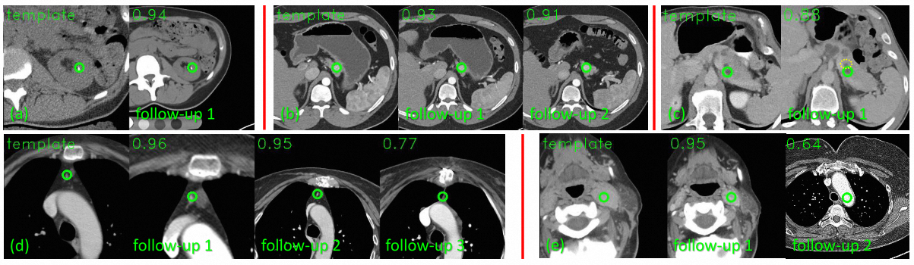

# SAM (Self-supervised Anatomical eMbedding) and UAE (Universal Anatomical Embedding)
Please find our papers:
1. Xiaoyu Bai, Fan Bai, Xiaofei Huo, Jia Ge, Jingjing Lu, Xianghua Ye, Ke Yan, Yong Xia, "UAE: Universal Anatomical 
Embedding on Multi-modality Medical Images". 2023 ([arXiv](https://arxiv.org/pdf/2311.15111.pdf))
2. Ke Yan, Jinzheng Cai, Dakai Jin, Shun Miao, Dazhou Guo, Adam P. Harrison, Youbao Tang, 
Jing Xiao, Jingjing Lu, Le Lu, "SAM: Self-supervised Learning of Pixel-wise Anatomical Embeddings in Radiological 
Images". IEEE Trans. on Medical Imaging, 2022 ([arXiv](https://arxiv.org/abs/2012.02383))

SAM can be used to match arbitrary anatomical landmarks between two radiological images (e.g. CT, MR, X-ray, etc.) You
can pick one point in any anatomy from one image, and then use SAM to detect it in all other images. Its applications
include but are not limited to:
* Lesion tracking in longitudinal data;
* One-shot universal anatomical landmark detection;
* Using the landmarks to help to align two images, e.g. for registration ([SAME](https://arxiv.org/abs/2109.11572),
[SAMConvex](https://arxiv.org/abs/2307.09727));
* Using the landmarks to extract anatomy-aware features ([phase recognition](https://openreview.net/forum?id=0wblcjbC2sN));
* Using the cross-image matching to help self-supervised learning ([Alice](https://arxiv.org/pdf/2302.05615.pdf)); etc.

Here are some examples of SAM's lesion tracking results on the DeepLesion dataset. Green circles mark the lesion’s central point in the template 
scan and the detected points in follow-up scans. The predicted similarity scores are also shown. See paper for details.



SAM has several advantages:
* Unsupervised in training;
* Fast in inference;
* Can be used to match arbitrary points in body;
* Robust to common image variations, such as inter-subject variability, organ deformation, contrast injection,
different field-of-views, moderate pathological changes, image noise, and even modality change.

The original SAM was proposed by Ke Yan. We improved SAM and proposed Universal Anatomical Embedding (UAE), including 
UAE-S and UAE-M, which are designed for single- and multi-modality embedding learning:
* Using organ mask supervision to enhance the semantic information of SAM embeddings, allowing it to match better in hard 
organs;
* Inventing a structural inference technique to refine the matched coordinates;
* Leveraging aggressive contrast augmentation and a novel iterative training process to enable cross-modality matching (e.g. CT and
multi-modal MR).

This repo contains both the original SAM reimplementation and UAE. It is written by **Xiaoyu Bai** (bai.aa1234241@gmail.com), 
Medical AI Lab, Alibaba DAMO Academy.

## Algorithm framework and more examples
See [this page](./resources/algorithm_frameworks.md).

## Usage

### Requirements
- `Python 3`
- `Pytorch=1.9.0`
- `mmcv=1.4.7`
- `mmdetection=2.20`
- `SimpleITK`
- `Torchio`
- `Nibabel`
- `Numpy`
- `skimage`

### Install
```
python3 -m venv venv_sam
source venv_sam/bin/activate
python -m pip install -e .  # note that mmcv may take a long time to install
```
The pretrained checkpoints and sample data are stored in [ModelScope](https://www.modelscope.cn/home). To download, 
please run `pip install modelscope` in the virtual environment, and then run
```
from modelscope.hub.snapshot_download import snapshot_download
model_dir = snapshot_download('viggin/Self-supervised_Anatomical_Embeddings', cache_dir='path/to/local/dir', revision='v1.0.0')
```
Finally, put the downloaded directories `checkpoints` and `data` to the project folder.

### Pretrained models
There are three models:
* `SAM.pth`: Original SAM model trained on the NIH Lymphnode dataset. It covers the chest-abdomen-pelvis region in CT.
* `SAMv2_iter_20000.pth`: UAE-S model trained on the NIH Lymphnode and the TotalSegmentator dataset. It covers the 
head-neck-chest-abdomen-pelvis region in CT.
* `CrossSAM_iter_20000_ct_mr_inter_1.pth` UAE-M model trained on the NIH Lymphnode and an Abdomen CT-MRI dataset.
It covers the upper abdomen region in CT and T2 MRI. Surprisingly, it can also be used in other MRI modalities such as 
T1, showing good out-of-domain generalization ability.

### Demo

We have prepared a few example images in `data` folder. You can try the pretrained models with them or your own data.

- For the original SAM model, use:
```
# assume all input image are in torchio "LPS+" direction which equals to "RAI" orientation in ITK-Snap.
tools/demo.py
```
- For UAE-S, use:
```
tools/demo_semantic.py # for UAE-S model with semantic branch and with naive single-point nearest neighbour (NN) matching
or
tools/demo_semantic_stable_points.py # for UAE-S with fixed-points based structural inference, slower but more accurate
```
- For UAE-M, use:
```
tools/demo_ct_mr.py  # for inter-modality matching between abdominal CT and MR
```

### Training details
See [this page](./resources/training.md).

### Notes
* When you want to match points between several images in multiple rounds, a way to save time is to first generate the 
embeddings of all images in advance, and then you can do matching with them. The major time cost lies in embedding computation.
* SAM may be inaccurate on areas without apparent discriminative textures, such as bowel, muscle, fat, and skin. It cannot
match points outside the human body, or body parts outside chest-abdomen-pelvis.
  * Note that sometimes it is hard to define exact matching points, because similarity varies by viewing angles.