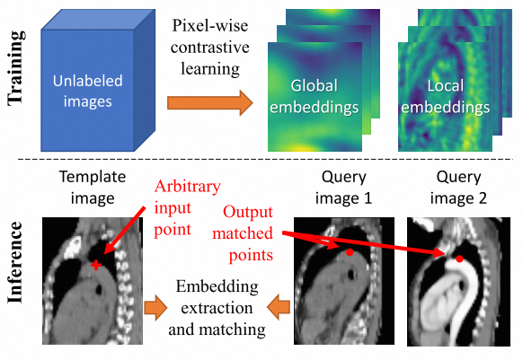
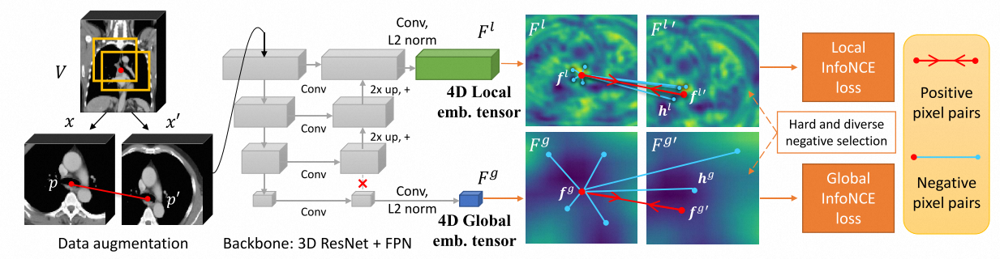
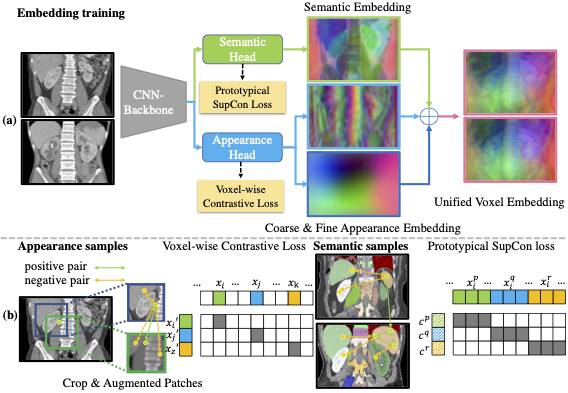
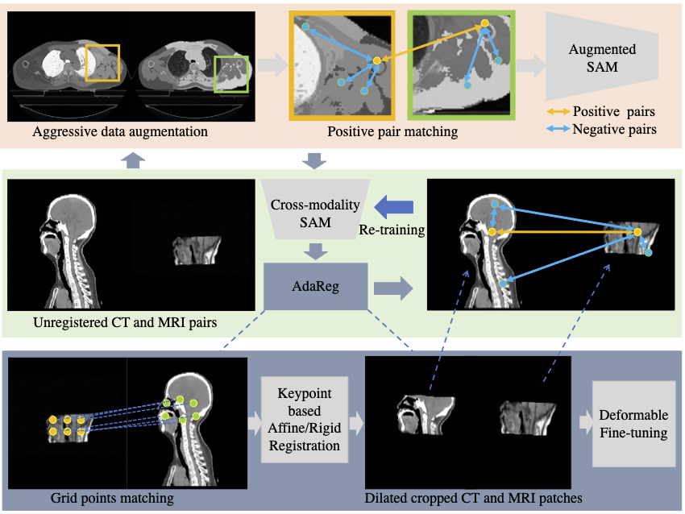
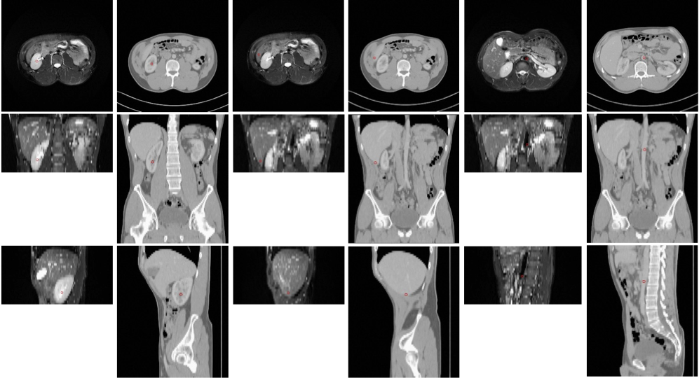
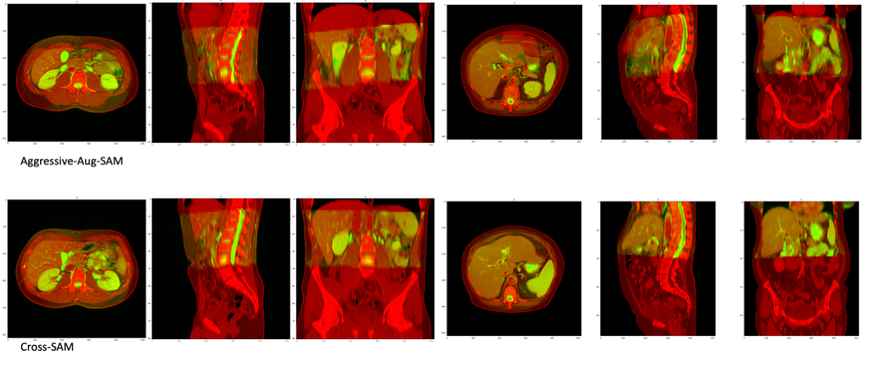

# Frameworks

### SAM

See [arXiv](https://arxiv.org/abs/2012.02383). Flowchart:

Network and loss:

### SAM++

See [arXiv](https://arxiv.org/abs/2306.13988). Semantic head:

Structural inference (fixed-point iteration):

### Cross-SAM

Cross-SAM is a generalized SAM framework for cross-modality embedding learning, see [arXiv](https://arxiv.org/abs/2307.03535).

Flowchart:

MRI to CT point matching results:

Cross-SAM can be used for cross-modality registration, even if the two modalities have large FOV difference, see the 
following examples with large CT images and small MR ones. 

We first use Aggressive-SAM/Cross-SAM to find grid matching points
on the CT-MRI data, and then do rigid registration, followed by DEEDS deformable fine-tuning.

The Aggressive-SAM is trained using only intra-modality data and would result some false alignment but the overall body part is correct.
Cross-SAM is trained on top of the registration results of the Aggressive-SAM. 

